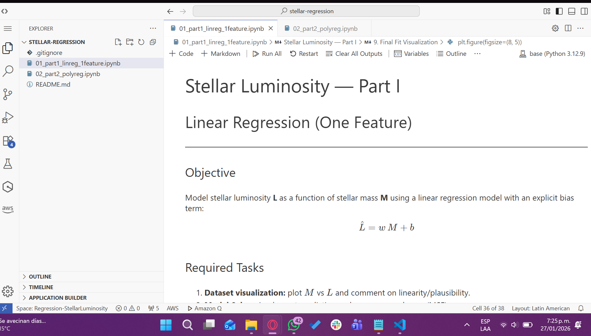
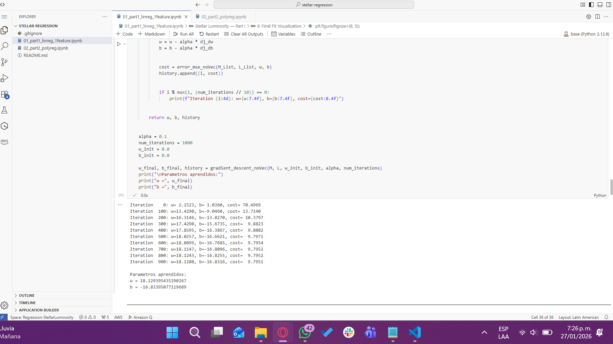
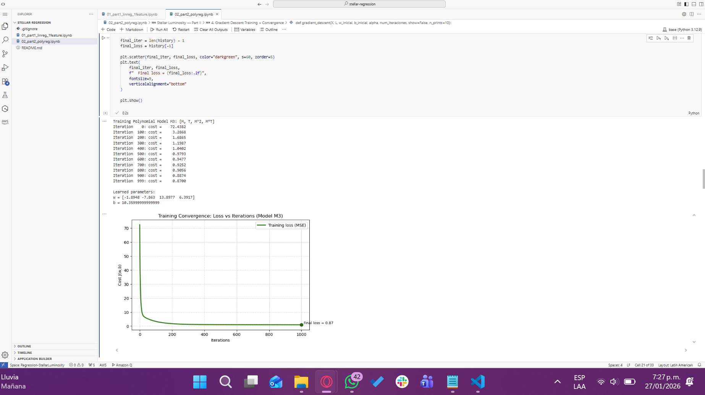
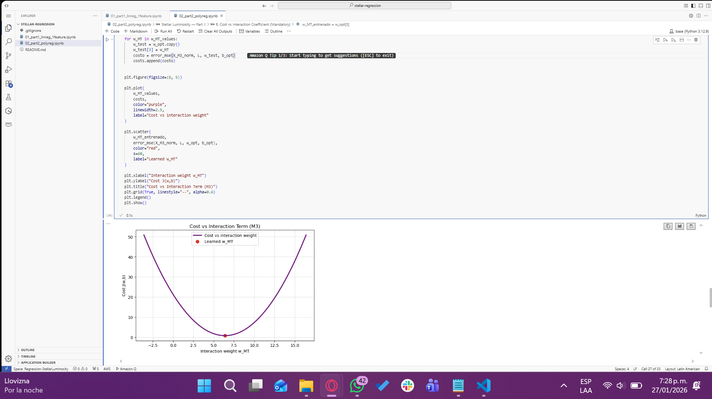
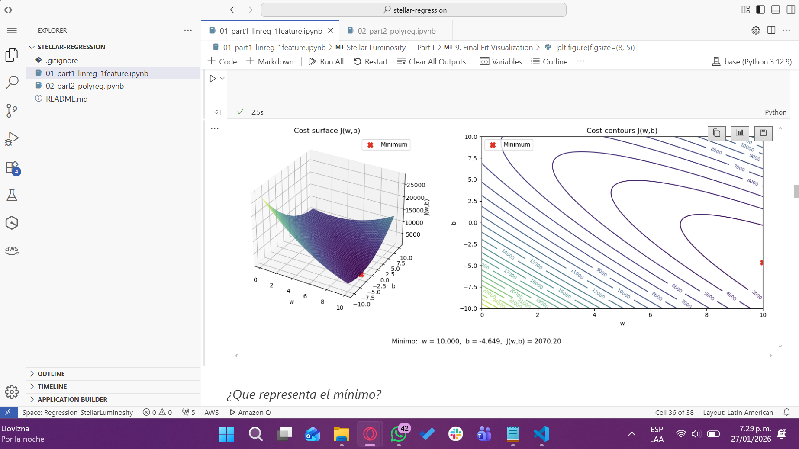

<div align="center">

# Predicción de Luminosidad Estelar

### Regresión Lineal y Polinómica con Descenso de Gradiente


</div>

---

## Descripción del Proyecto

Este proyecto explora la relación entre la **masa estelar (M)**, la **temperatura (T)** y la **luminosidad (L)** utilizando modelos de regresión lineal y polinómica entrenados mediante descenso de gradiente.

**Objetivos:**
- Analizar el comportamiento del modelo con diferentes representaciones de características
- Estudiar las interacciones entre características y su impacto en el rendimiento
- Evaluar las propiedades de convergencia durante el entrenamiento
- Comparar el desempeño predictivo a través de diferentes niveles de complejidad del modelo

### Modelos Evaluados

| Modelo | Características | Descripción |
|--------|-----------------|-------------|
| **M1** | `[M, T]` | Modelo lineal base |
| **M2** | `[M, T, M²]` | Incorpora término polinómico |
| **M3** | `[M, T, M², M·T]` | Incluye término de interacción |

---

## Estructura del Repositorio

```
Regression-StellarLuminosity/
│
├── notebook_1_linear_regression.ipynb      
├── notebook_2_feature_engineering.ipynb    
├── README.md                                
└── images/
    └── sagemaker/                          
```

---

## Metodología

### Componentes Implementados

Todos los componentes fueron implementados desde cero:

- **Función de predicción**: Cálculo del paso hacia adelante
- **Error Cuadrático Medio (MSE)**: Cálculo de la función de pérdida
- **Cálculo de gradientes**: Derivadas analíticas
- **Descenso de Gradiente**: Algoritmo de optimización
- **Normalización de características**: Garantiza convergencia estable
- **Ingeniería de características**: Términos polinómicos y de interacción

### Visualización

El proyecto incluye visualizaciones completas de:

- Estructura y distribución del conjunto de datos
- Topología de la superficie de costo
- Comportamiento de convergencia a través de las iteraciones
- Análisis de importancia del término de interacción
- Comparación entre valores predichos y reales
- Inferencia sobre datos estelares no vistos

---

## Resultados Principales

| Métrica | Hallazgo |
|---------|----------|
| **Rendimiento del Modelo** | M3 > M2 > M1 (menor pérdida final) |
| **Característica Crítica** | El término de interacción M·T mejora significativamente la precisión |
| **Convergencia** | Estable después de la normalización de características |
| **Generalización** | Predicciones confiables dentro del rango de datos observados |

### Conclusiones Principales

> Los **términos polinómicos y de interacción** (M2, M3) logran una pérdida final sustancialmente menor que el modelo lineal (M1)

> El **término de interacción M·T** es crucial para capturar la relación entre masa y temperatura

> La **normalización de características** asegura una convergencia estable y consistente en todos los modelos

> Las **predicciones del modelo** se alinean bien con las tendencias del conjunto de datos cuando se interpola dentro de los rangos observados

---

## Ejecución en AWS SageMaker

Esta sección documenta el proceso completo de despliegue y ejecución de los notebooks en AWS SageMaker Studio, utilizando Code Editor (Visual Studio Code) integrado con el kernel Python por defecto.

---

### Requisitos Previos

| Componente | Requisito |
|------------|-----------|
| **Cuenta AWS** | Acceso activo a Amazon SageMaker |
| **Permisos IAM** | Rol con permisos SageMaker (ej: LabRole) |
| **Navegador** | Versión actualizada compatible |

---

### Proceso de Despliegue

#### **Paso 1: Configuración Inicial de SageMaker Studio**

1. Acceder a la AWS Management Console
2. Navegar al servicio Amazon SageMaker
3. Seleccionar Studio desde el panel lateral
4. Abrir SageMaker Studio con el perfil de usuario configurado
5. Verificar que el estado del espacio esté en Running

#### **Paso 2: Iniciar Code Editor**

1. En el panel de Applications, seleccionar Code Editor
2. Crear o abrir un espacio de Code Editor existente
3. Hacer clic en Open Code Editor
4. Se desplegará la interfaz de Visual Studio Code en el navegador

#### **Paso 3: Preparación del Proyecto**

Dentro del Code Editor:

```bash
# Crear estructura del proyecto
mkdir stellar-regression
cd stellar-regression
```

Cargar los archivos del proyecto:

- `01_part1_linreg_1feature.ipynb`
- `02_part2_polyreg.ipynb`
- `README.md`

> **Nota:** Los archivos pueden subirse mediante drag & drop o usando la función Upload del explorador.

#### **Paso 4: Configuración del Entorno de Ejecución**

Al abrir cada notebook:

1. Seleccionar el kernel Python por defecto de SageMaker
2. El entorno incluye las librerías necesarias pre-instaladas:
   - Python 3.x
   - NumPy
   - Matplotlib

> **Decisión de diseño:** Se utilizó el entorno por defecto para evitar problemas de conectividad y tiempos de espera al configurar entornos virtuales personalizados.

#### **Paso 5: Ejecución y Validación**

Para cada notebook:

- ✓ Ejecutar todas las celdas secuencialmente (`Run All`)
- ✓ Verificar salidas numéricas sin errores
- ✓ Confirmar renderizado correcto de visualizaciones
- ✓ Validar coherencia de resultados

---

### Evidencia Visual

#### **1. Ambiente de Trabajo en SageMaker Studio**

<div align="center">
  
  <br>
  <sub><b>Figura 1:</b> Interfaz de SageMaker Studio mostrando ambos notebooks del proyecto cargados en Code Editor</sub>
</div>

<br>

#### **2. Ejecución de Código y Outputs**

<div align="center">
  
  <br>
  <sub><b>Figura 2:</b> Celdas ejecutadas exitosamente con salidas numéricas y logs del proceso de entrenamiento</sub>
</div>

<br>

#### **3. Visualizaciones Generadas**

<div align="center">
  
  
  <br>
  <sub><b>Figura 3:</b> Visualización del comportamiento de convergencia y topología de la superficie de costo</sub>
  
  <br><br>
  
  
  <br>
  <sub><b>Figura 4:</b> Comparación entre valores predichos y observados del modelo entrenado</sub>
  
  <br><br>
  
  
  <br>
  <sub><b>Figura 5:</b> Representación tridimensional de la superficie de costo durante la optimización</sub>
  
</div>

---

### Análisis Comparativo

| Aspecto Evaluado | Ejecución Local | Ejecución SageMaker | Estado |
|------------------|-----------------|---------------------|--------|
| **Entorno** | Jupyter + Python local | SageMaker Studio + Code Editor | ✅ |
| **Resultados Numéricos** | Correctos | Correctos | ✅ |
| **Visualizaciones** | Generadas | Generadas | ✅  |
| **Errores** | Ninguno | Ninguno | ✅  |
| **Portabilidad** | Requiere configuración | Preconfigurado | ✅ |

#### Observaciones

**Ejecución Local:**
- Los notebooks se ejecutaron correctamente en un entorno local con Jupyter y Python
- Se requirió instalación manual de dependencias (NumPy, Matplotlib)
- Resultados numéricos y visualizaciones generados exitosamente

**Ejecución en SageMaker:**
- Los resultados numéricos fueron consistentes con la ejecución local
- Las gráficas renderizadas coinciden visualmente con las generadas localmente
- El entorno preconfigurado eliminó la necesidad de gestión manual de librerías

**Conclusión:**
No se observaron diferencias significativas en los resultados, lo que demuestra que el código es portable y reproducible en un entorno cloud.

---

### Conclusiones del Despliegue

**Ventajas de AWS SageMaker:**

- Entorno estandarizado y reproducible sin configuración local
- Gestión automática de dependencias y librerías
- Interfaz familiar (VS Code) en la nube
- Escalabilidad y recursos computacionales bajo demanda
- Integración nativa con servicios AWS

**Resultado:** La plataforma SageMaker demostró ser una solución robusta para la ejecución de modelos de machine learning, garantizando resultados idénticos a la ejecución local con mayor facilidad de gestión y reproducibilidad.

---


